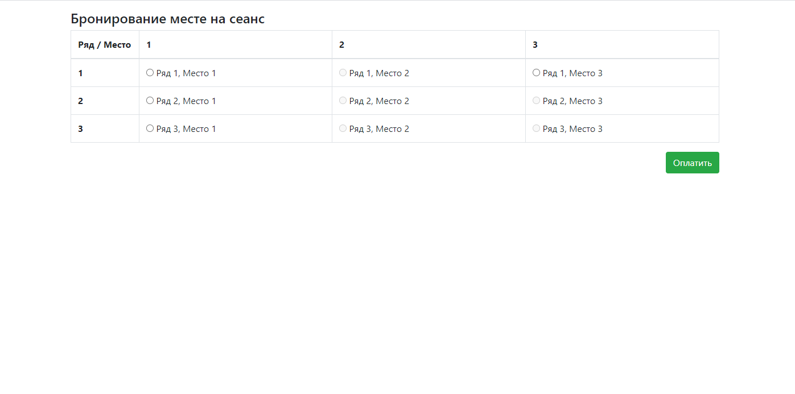

# job4j_cinema

Проект Cinema представляет собой сервис по бронированию билетов на киносеансы.
Сервис позволяет зарезервировать место за определённым пользователем.

Список использованных технологий:
- Java 11, Maven, Junit 4
- Servlet API
- Postgresql, JDBC, otj-pg-embedded 
- HTML, CSS, JavaScript (ES6), Bootstrap 4 

